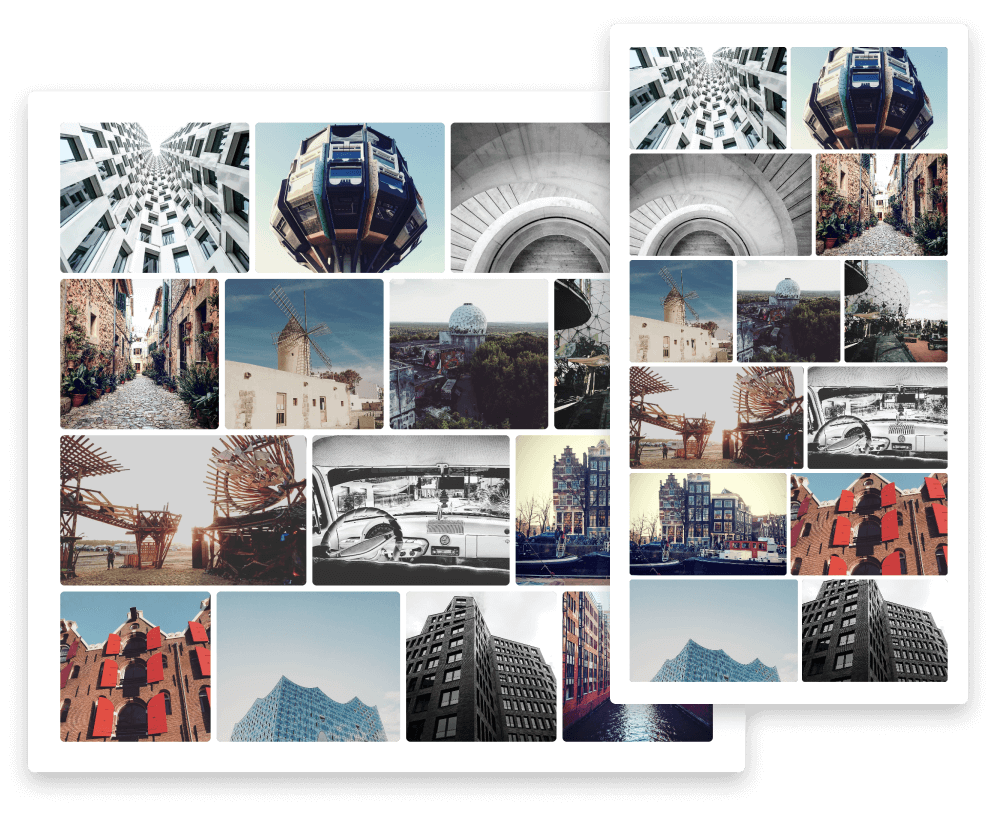

# flex-gallery

>A responsive lightbox gallery with flexbox and progressive image loading.



## Installation

```sh
npm install flex-gallery
```

## Usage

### HTML:

```html
<div class="gallery">
    <div class="gallery-item">
        
        <div class="caption" title="Image 1"><span>Image 1</span></div>
    </div>

    <div class="gallery-item">
        
        <div class="caption" title="Image 2"><span>Image 2</span></div>
    </div>
</div>
```

| Attribute           | Description                                    |
| ------------------- | ---------------------------------------------- |
| src                 | Placeholder until data-src is lazy loaded      |
| data-src            | Gallery item image                             |
| data-srcset         | Gallery item srcset                            |
| data-image          | Lightbox image                                 |
| data-image-srcset   | Lightbox image srcset                          |
| data-image-fallback | Lightbox image fallback for unsupported srcset |
| data-title          | Title for the lightbox header                  |

### JS:

```js
import flexGallery from 'flex-gallery';

flexGallery();
```

or with options:

```js
flexGallery({
    transitionDuration: 400,
    swipingThreshold: 5,
    slideChangeThreshold: 150,
});
```

| Property             | Description                                                       |
| -------------------- | ----------------------------------------------------------------- |
| transitionDuration   | Time of a slide transition (in milliseconds)                      |
| swipingThreshold     | Threshold for a swipe gesture to be recognized as swiping (in px) |
| slideChangeThreshold | Threshold for a swipe to trigger a slide change (in px)           |

### SCSS:

```scss
@use 'flex-gallery';
```

## Customize

Example for overriding variables:

```scss
@use 'flex-gallery' with (
    $gallery-item-height: 250px,
    $gallery-item-overlay-bg: url('path/to/your/custom-bg-image.png'),
    $lightbox-bg-color: #222,
    $lightbox-header-bg-color: #999,
    $lightbox-header-font-weight: 400
);
```

All default variables:

```scss
// --------------------------------
// SVG Icons
// --------------------------------
$icon-enlarge-color: white !default;
$icon-chevron-color: white !default;

$icon-enlarge-svg: '<svg xmlns="http://www.w3.org/2000/svg" width="37" height="37" viewBox="0 0 37 37" fill="none"><path stroke="#{$icon-enlarge-color}" stroke-width="6" stroke-linecap="round" d="M23 23L34 34M26 14.5C26 20.8513 20.8513 26 14.5 26C8.14873 26 3 20.8513 3 14.5C3 8.14873 8.14873 3 14.5 3C20.8513 3 26 8.14873 26 14.5Z"/></svg>' !default;
$icon-chevron-left-svg: '<svg xmlns="http://www.w3.org/2000/svg" width="32" height="53" viewBox="0 0 32 53"><path fill="#{$icon-chevron-color}" fill-rule="evenodd" clip-rule="evenodd" d="M0 26.5L27.3171 0L32 4.54286L9.36585 26.5L32 48.4571L27.3171 53L0 26.5Z"/></svg>' !default;
$icon-chevron-right-svg: '<svg xmlns="http://www.w3.org/2000/svg" width="32" height="53" viewBox="0 0 32 53"><path fill="#{$icon-chevron-color}" fill-rule="evenodd" clip-rule="evenodd" d="M32 26.5L4.68293 53L0 48.4571L22.6341 26.5L3.83911e-06 4.54286L4.68293 0L32 26.5Z"/></svg>' !default;

// --------------------------------
// Gallery Settings
// --------------------------------
$gallery-item-height: 300px !default;
$gallery-item-margin: 0.5em !default;
$gallery-item-overlay-bg-color: rgba(#000, 0.4) !default;
$gallery-item-overlay-bg-image: url(utils.svg-encode($icon-enlarge-svg)) !default;
$gallery-item-overlay-bg: $gallery-item-overlay-bg-color $gallery-item-overlay-bg-image center / 1.85rem no-repeat !default;
$gallery-item-caption-bg-color: rgba(#000, 0.6) !default;
$gallery-item-thumb-bg-color: #333 !default;

// --------------------------------
// Lightbox Settings
// --------------------------------
$lightbox-bg-color: #2e2e35 !default;
$lightbox-z-index: 9999 !default;
$lightbox-text-color: white !default;
$lightbox-close-color: white !default;
$lightbox-header-bg-color: rgba(#000, 0.3) !default;
$lightbox-header-padding: 1em !default;
$lightbox-header-font-weight: 600 !default;
$lightbox-arrow-left-bg-image: url(utils.svg-encode($icon-chevron-left-svg)) !default;
$lightbox-arrow-right-bg-image: url(utils.svg-encode($icon-chevron-right-svg)) !default;
```

## TODO

-   Provide method for adding gallery items programmatically
-   Fire events when opening/closing lightbox and on slide change

## License

MIT
